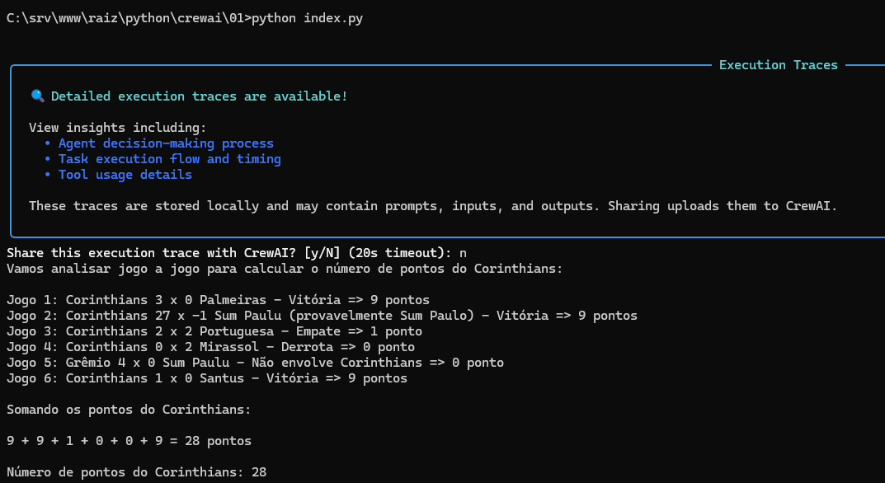

# Passos para execu&ccedil;&atilde;o

&Eacute; bem simples:

1- Crie uma vari&aacute;vel de ambiente OPENAI_API_KEY com sua chave de API da Open AI. Gastar&aacute; (assim foi em meus testes) no m&aacute;ximo $0.01.

2- Execute:

```sh
python index.py
```


# Vers&atilde;o de Python testada

```sh
C:\srv\www\raiz\python\crewai\01>python --version
Python 3.13.14
```


# Exemplo de sa&iacute;da da execu&ccedil;&atilde;o do index.py




# LLM usada

Em um curso estudamos a integra&ccedil;&atilde;o com a Open AI.


## &Eacute; poss&iacute;vel usar outro LLM?

Se d&aacute; para integrar com o Gemini ou Claude ou outro? Provavelmente sim, mas nunca testei isto.


## Como acessar plataforma e obter cr&eacute;ditos da Open AI

Acesse [este link](https://platform.openai.com)